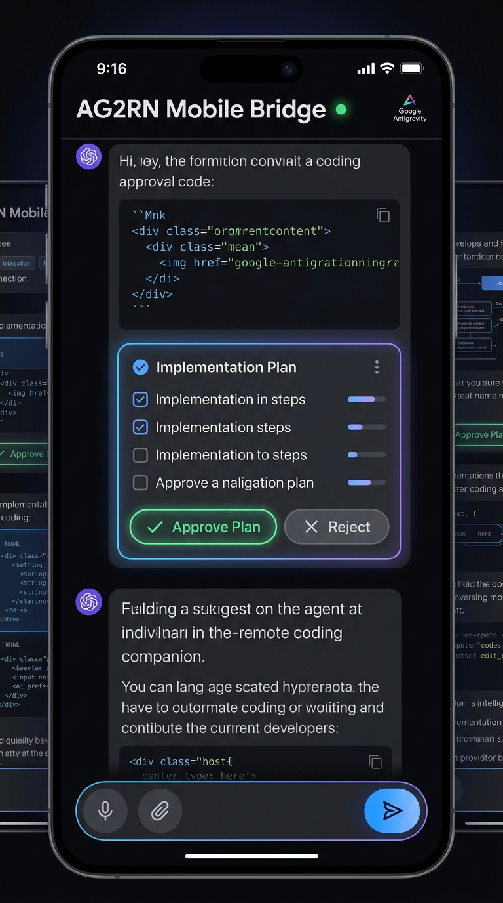
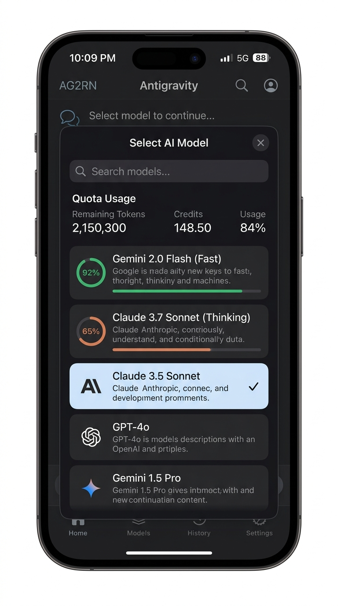
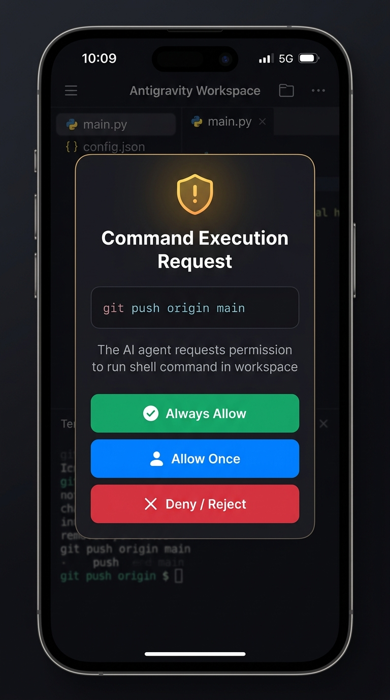
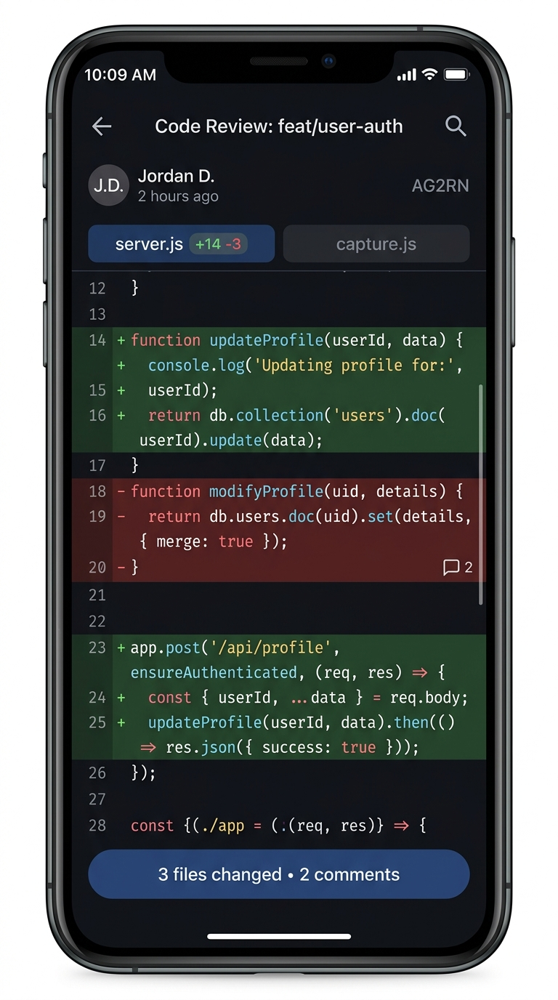
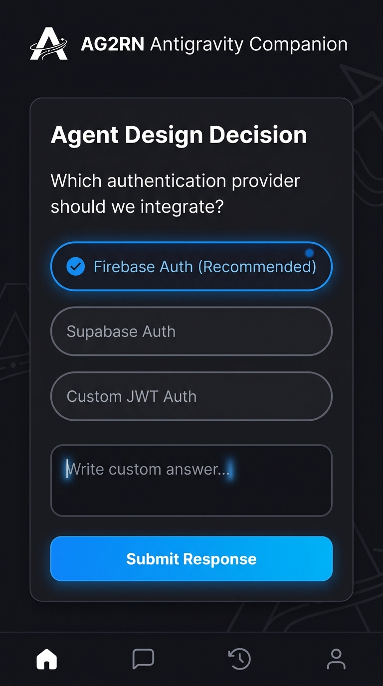
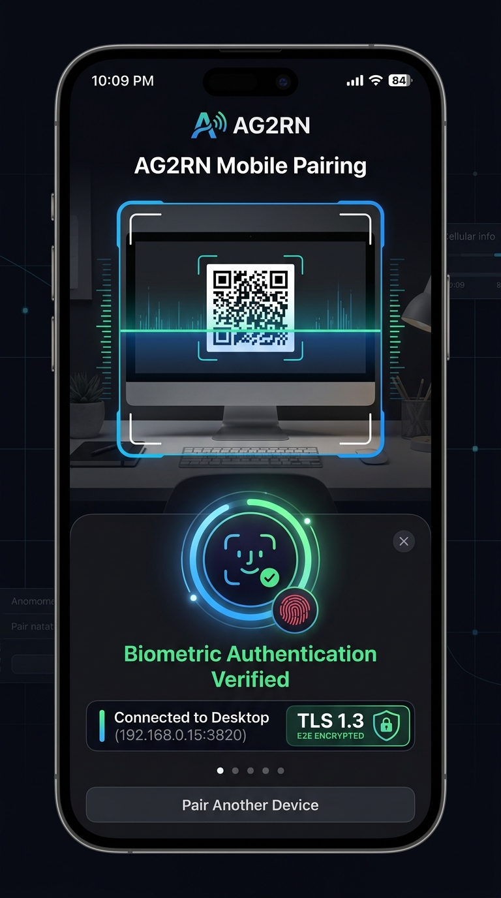

# AG2RN — Antigravity 2.0 Remote Native

[](https://antigravity.google)
[](#-system-architecture)
[](./LICENSE)

**AG2RN** (*Antigravity 2.0 Remote Native*) is a native cross-platform companion and remote bridge suite engineered for **Google Antigravity 2.0**. It empowers developers to monitor autonomous AI coding agents, approve terminal command executions, answer interactive design questions, switch AI models with live quota tracking, review git diffs, and chat directly with their agent sessions from **iOS**, **Android**, and desktop environments from anywhere in the world.

---

## 📱 Mobile Experience & Showcase (9:16)

<table align="center">
  <tr>
    <td align="center" width="33%">
      <br>
      <b>Live Chat & Plan Approval</b><br>
      <sub>Real-time reasoning logs & 1-tap plan approval</sub>
    </td>
    <td align="center" width="33%">
      <br>
      <b>14-Model Selector & Quota</b><br>
      <sub>Real-time usage rings for Gemini, Claude & GPT</sub>
    </td>
    <td align="center" width="33%">
      <br>
      <b>Terminal Permission Approvals</b><br>
      <sub>Remote shell execution authorization & safety</sub>
    </td>
  </tr>
  <tr>
    <td align="center" width="33%">
      <br>
      <b>Code Review & Diff Canvas</b><br>
      <sub>Syntax-highlighted line diffs & file trees</sub>
    </td>
    <td align="center" width="33%">
      <br>
      <b>Interactive Interviews</b><br>
      <sub>Answer <code>ask_question</code> choice chips & prompts</sub>
    </td>
    <td align="center" width="33%">
      <br>
      <b>QR Pairing & Biometrics</b><br>
      <sub>Instant camera pairing & Face ID encryption</sub>
    </td>
  </tr>
</table>

---

## 🚀 Key Improvements & What's New in this Fork

AG2RN is an advanced evolution and native rewrite of the original AG2R bridge, restructured from the ground up for production-grade mobile security, modern desktop control, and full compatibility with Antigravity 2.0:

### 1. 🖥️ Desktop Control Center (Electron + Tray)
* **Visual Dashboard & System Tray:** Run AG2RN quietly in the background on Windows, macOS, or Linux.
* **Auto-Discovery & Auto-Attach:** Automatically detects Antigravity 2.0 executable paths and `DevToolsActivePort` (port 9000 or dynamic). Launches with `--remote-debugging-port` with 1 click.
* **Embedded Tunneling Daemon:** Built-in Cloudflare Quick Tunnel and local network discovery for zero-port-forwarding pairing.
* **Ephemeral QR Pairing:** Generates signed pairing payloads with rotating security tokens.

### 2. 📱 Native Mobile Companion Suite (iOS & Android)
* **True Native Runtime:** Built on Capacitor with custom Swift (iOS) and Kotlin (Android) plugins.
* **Biometric Hardware Security:** Protected by **Face ID**, **Touch ID**, or **Android Biometrics**.
* **Encrypted Token Vault:** Cryptographic credentials stored securely inside **iOS Keychain** and **Android Keystore**.
* **In-App QR Scanner:** Point your smartphone camera at the desktop dashboard to establish a secure TLS session in under 3 seconds.

### 3. ☁️ Serverless Push Notification Gateway
* **Actionable Remote Alerts:** Receive immediate lock-screen push notifications (APNs / FCM) when an agent requires terminal command approval or answers.
* **Zero-Knowledge Privacy:** Edge-deployed Cloudflare Worker dispatches notifications without storing code, session logs, or private keys.

### 4. 🧠 Deep Antigravity 2.0 CDP Engine & UI Fidelity
* **Radix UI & `cmdk` Modal Support:** Native capture and index-based click dispatching for Radix popovers, command items (`[cmdk-item]`, `[data-radix-collection-item]`), and dropdown menus.
* **14-Model Selector with Quota Rings:** Native support for the full Antigravity model catalog (Gemini 2.0 Flash, Claude 3.7 Sonnet Thinking, GPT-4o, etc.) with real-time percentage quota rings.
* **Optimistic Code Review Panel:** Instant slide-out review panel with cached diff rendering and stale-snapshot suppression.
* **Interactive Approvals (`ask_question` & Permissions):** Clean mobile modals to submit option choices or allow/reject shell operations.

---

## 🏗️ System Architecture

```
┌─────────────────────────────────────────────────────────────────────────────────┐
│                            1. YOUR COMPUTER (Host)                              │
│                                                                                 │
│  ┌─────────────────────────┐               ┌─────────────────────────────────┐  │
│  │     Antigravity 2.0     │   CDP Port    │       AG2RN Desktop Server      │  │
│  │   (Agent Orchestrator)  │◄─────────────►│     (Electron + System Tray)    │  │
│  └─────────────────────────┘  (Auto 9000)  │  ┌───────────────────────────┐  │  │
│                                            │  │   Control Panel Dashboard │  │  │
│                                            │  ├───────────────────────────┤  │  │
│                                            │  │   CDP Bridge Core Engine  │  │  │
│                                            │  ├───────────────────────────┤  │  │
│                                            │  │   Embedded Tunnel Daemon  │  │  │
│                                            │  └─────────────┬─────────────┘  │  │
└────────────────────────────────────────────┼────────────────┼────────────────┘  │
                                             │                │                   │
                     ┌───────────────────────┘                └──────────────┐    │
                     │                                                       │    │
                     ▼ WSS / TLS Encrypted                                   ▼    │
     ┌────────────────────────────────┐                    ┌───────────────────┐  │
     │      2. AG2RN Mobile App       │                    │ 3. Cloud Relay    │  │
     │      (iOS & Android)           │                    │ (Push Gateway)    │  │
     │                                │                    └─────────┬─────────┘  │
     │  • QR Scanner & Auto-Pairing   │                              │ APNs / FCM │
     │  • Biometric Security (FaceID) │                              │ (Alert)    │
     │  • Live Chat & Diff Canvas     │◄─────────────────────────────┘            │
     │  • Interactive Permission Push │                                           │
     └────────────────────────────────┘                                           │
```

---

## 🚀 Quickstart Guide

### Prerequisites
- **Node.js 18+**
- **Google Antigravity 2.0** installed

### 1. Installation
```bash
git clone https://github.com/imnomad/ag2rn.git
cd ag2rn
npm install
```

### 2. Start the Server
```bash
# Starts the core bridge server with auto-port detection and local TLS
npm start
```

### 3. Launch Desktop Control Center
```bash
# Launches the desktop dashboard with System Tray and QR pairing display
npm run desktop
```

### 4. Build Mobile Companion
```bash
# Synchronizes mobile assets for iOS & Android
npm run mobile:build
```

### 5. Run Test Suite
```bash
# Validates lifecycle detection, pairing security, and CDP core
npm test
```

---

## 📁 Monorepo Structure

```
ag2rn/
├── packages/
│   ├── core/                  # CDP capture engine, WebSocket bridge, lifecycle & pairing
│   │   ├── src/
│   │   │   ├── cdp-scripts/   # Browser-side scripts evaluated in Antigravity via CDP
│   │   │   ├── lifecycle/     # OS-specific process detection (Windows, macOS, Linux)
│   │   │   ├── tunnel/        # Cloudflare tunnel & local IP discovery
│   │   │   └── pairing/       # Ephemeral token cryptography & QR payload builder
│   │   └── test/              # Lifecycle and pairing test suite
│   │
│   ├── desktop/               # Desktop application (Electron + Tray + Control Panel)
│   │   └── src/main.js        # Electron process lifecycle & tray menu
│   │
│   ├── mobile/                # Native Mobile Companion (Capacitor iOS & Android)
│   │   ├── ios/               # Xcode project (Face ID, Keychain, APNs)
│   │   ├── android/           # Android Studio project (Biometrics, Keystore, FCM)
│   │   ├── www/               # Synchronized mobile distribution web assets
│   │   └── build-mobile.js    # Mobile asset build script
│   │
│   └── push-gateway/          # Stateless Push Notification Gateway (Cloudflare Worker)
│       └── src/index.js       # Edge push dispatcher for APNs & FCM
│
├── public/                    # Web client assets, dashboard UI, icons and styles
├── server.js                  # Main server entrypoint (Express + WebSocket + CDP Bridge)
└── README.md
```

---

## 📄 License

MIT License — see [LICENSE](./LICENSE) for details.  
Original inspiration and CDP bridge foundation from [AG2R](https://github.com/the-future-company/ag2r).
